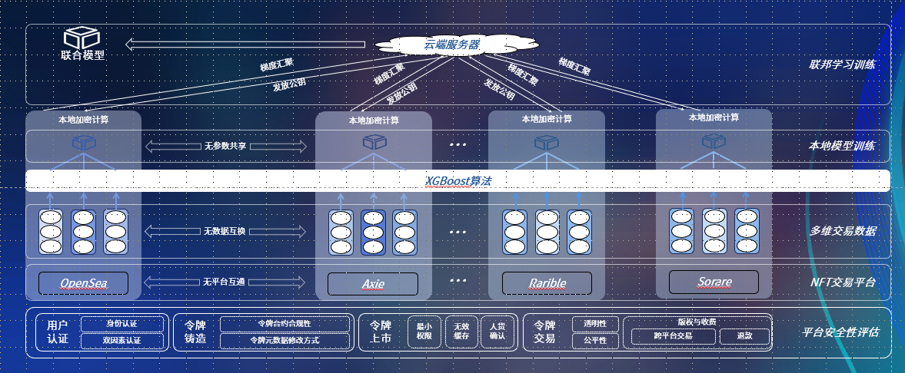

# NFT-AML-code：Federated Learning for NFT Anti-Money Laundering

## Introduction

NFT-AML is a project that aims to combat money laundering in the NFT (Non-Fungible Token) space. We propose a novel federated learning approach called FedBoost to detect suspicious transactions involving NFTs. FedBoost combines the power of XGBoost algorithm for local anomaly detection on individual devices and federated learning with gradient aggregation optimization for global model training. Our project is currently being developed for the Citi Innovation Contest.

## Requirements

- python==3.6.9
- Flask==2.0.0
- Pillow==7.0.0
- requests==2.23.0
- tensorflow-gpu==1.14.0
- tqdm==4.44.1

## How to Use

### Local Setup:

1. Clone the repository:

git clone https://github.com/Martin1007Wang/NFT-AML.git cd NFT-AML

2. Install the required dependencies:

3. ...

### Training

1. Configure the training settings in the configuration file `config.json`.
2. Start the federated learning server:     python FLtrainer_server.py
3. Run the federated learning client on each device:   python FLtrainer_client.py

Feel free to explore the project and adapt it to your needs.

## License

This project is licensed under the [MIT License](LICENSE).